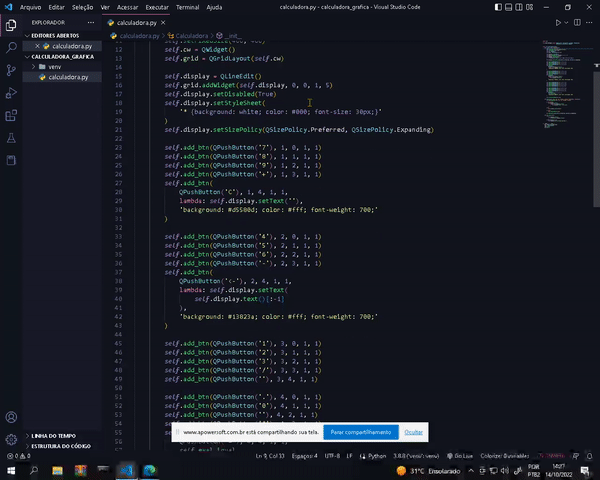

## Graphing Calculator Project 🐍🧮📈📉

### Graphical interface project with the `PyQt5` library of the `Python` programming language.




 The interface consists of a digital calculator generated in a virtualization environment without using an external graphical modeling environment. The `PyQt5` library is one of the most powerful ways to create a graphical environment and the challenge was to discover the different syntaxes that this library offers us...

 To install the library, you must first create a virtual environment for the application, so that it does not suffer interference from a global scope of other projects. For that we do:

 ```sh
    python -m venv nome_da_pasta
 ```

 After installing the virtual environment, install the `PyQt5` library

 ```sh
    pip install pyqt5          
 ```

 To run the file, just have performed all the previous steps and finally run

 ```sh
    python calculadora.py   
 ```